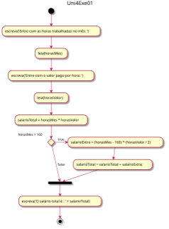
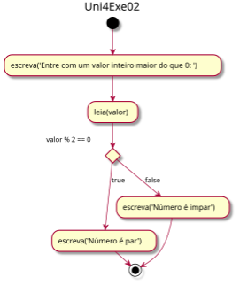
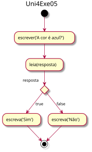
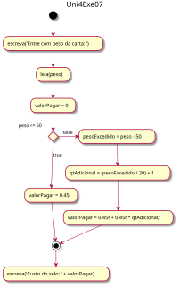

# Unidade 4: Estruturas de Seleção - Lista de Exercícios - atividadeAula

Implemente uma classe com o método main para cada um dos seguintes exercícios. Faça a análise do problema identificando as entradas, saídas e testes. Utilize somente os comandos que você aprendeu na disciplina até o momento para a resolução das atividades.  

Utilize o nome do arquivo Java e da Classe de acordo com o indicado no inicio de cada enunciado.  

----------

## Grupo SE (if)

### Uni4Exe01.java

A jornada de trabalho semanal de um funcionário é de 40 horas. O funcionário que trabalhar mais de 40 horas receberá hora extra, cujo cálculo é o valor da hora regular com um acréscimo de 50%. Escreva um algoritmo que leia o número de horas trabalhadas em um mês, o valor por hora e escreva o salário total do funcionário, que deverá ser acrescido das horas extras, caso tenham sido trabalhadas (considere que o mês possua 4 semanas exatas).  
Para resolver este problema pode se utilizar do algoritmo descrito no fluxograma:  
  

----------

## Grupo SE - SENÃO (if - else)

### Uni4Exe02.java

Dado um valor inteiro maior do que 0 informe se o valor é par ou ímpar.  
Para resolver este problema pode se utilizar do algoritmo descrito no fluxograma:  
  

----------

### Uni4Exe03.java

Dados dois números inteiros descreva um algoritmo para informar o maior valor entre eles.  

----------

### Uni4Exe04.java

Dado um número de ponto flutuante maior do que 0, informe se foram digitadas ou não casas decimais no número.  

----------

### Uni4Exe05.java

Dada uma pergunta, “a cor é azul?”, faça um programa que leia uma variável lógica com a resposta e responda “Sim”, caso a resposta seja true, ou “Não”, caso seja false.  
Para resolver este problema pode se utilizar do algoritmo descrito no fluxograma:  
  

----------

### Uni4Exe06.java

Faça um algoritmo que leia um caractere. Caso seja digitada a letra 'M' escreva “Masculino”. Se for digitada a letra 'F' escreva “Feminino”. Se for informado 'I' escreva “Não Informado”. Qualquer outra letra digitada escreva “Entrada Incorreta”. Atenção: antes de testar a letra, converta-a para maiúscula.  

----------

### Uni4Exe07.java

O custo do selo de uma carta com até 50 gramas é de R$ 0,45. As cartas com peso superior pagam um adicional de R$ 0,45 por cada 20 gramas, ou fração, em que excedem aquele peso. Escreva um algoritmo que dado o peso da carta, em gramas, determine o custo do selo.  
Para resolver este problema pode se utilizar do algoritmo descrito no fluxograma:  
  

----------
