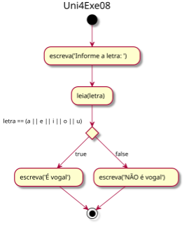
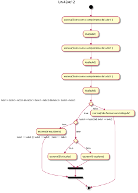
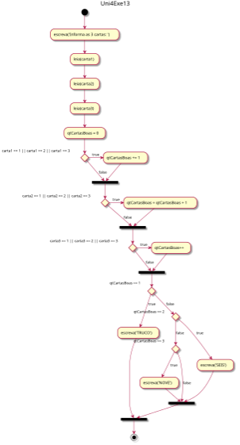
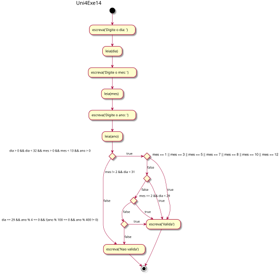
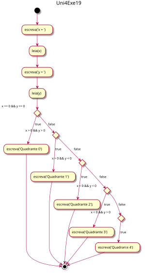

# Unidade 4: Estruturas de Seleção - Lista de Exercícios - atividadeAula

Implemente uma classe com o método main para cada um dos seguintes exercícios. Faça a análise do problema identificando as entradas, saídas e testes. Utilize somente os comandos que você aprendeu na disciplina até o momento para a resolução das atividades.  

Utilize o nome do arquivo Java e da Classe de acordo com o indicado no inicio de cada enunciado.  

----------

## Grupo SE (if)

### Uni4Exe01.java

A jornada de trabalho semanal de um funcionário é de 40 horas. O funcionário que trabalhar mais de 40 horas receberá hora extra, cujo cálculo é o valor da hora regular com um acréscimo de 50%. Escreva um algoritmo que leia o número de horas trabalhadas em um mês, o valor por hora e escreva o salário total do funcionário, que deverá ser acrescido das horas extras, caso tenham sido trabalhadas (considere que o mês possua 4 semanas exatas).  
Para resolver este problema pode se utilizar do algoritmo descrito no fluxograma:  
  

----------

## Grupo SE - SENÃO (if - else)

### Uni4Exe02.java

Dado um valor inteiro maior do que 0 informe se o valor é par ou ímpar.  
Para resolver este problema pode se utilizar do algoritmo descrito no fluxograma:  
  

----------

### Uni4Exe03.java

Dados dois números inteiros descreva um algoritmo para informar o maior valor entre eles.  

----------

### Uni4Exe04.java

Dado um número de ponto flutuante maior do que 0, informe se foram digitadas ou não casas decimais no número.  

----------

### Uni4Exe05.java

Dada uma pergunta, “a cor é azul?”, faça um programa que leia uma variável lógica com a resposta e responda “Sim”, caso a resposta seja true, ou “Não”, caso seja false.  
Para resolver este problema pode se utilizar do algoritmo descrito no fluxograma:  
  

----------

### Uni4Exe06.java

Faça um algoritmo que leia um caractere. Caso seja digitada a letra 'M' escreva “Masculino”. Se for digitada a letra 'F' escreva “Feminino”. Se for informado 'I' escreva “Não Informado”. Qualquer outra letra digitada escreva “Entrada Incorreta”. Atenção: antes de testar a letra, converta-a para maiúscula.  

----------

### Uni4Exe07.java

O custo do selo de uma carta com até 50 gramas é de R$ 0,45. As cartas com peso superior pagam um adicional de R$ 0,45 por cada 20 gramas, ou fração, em que excedem aquele peso. Escreva um algoritmo que dado o peso da carta, em gramas, determine o custo do selo.  
Para resolver este problema pode se utilizar do algoritmo descrito no fluxograma:  
  

----------
## Grupo COMPOSTO E e OU (&& e ||)

### Uni4Exe08.java

Dado uma letra, escreva um algoritmo que informe se ela é ou não uma vogal.  
Para resolver este problema pode se utilizar do algoritmo descrito no fluxograma:  
  

| Exemplos de entrada | Exemplos de saída |
| -------- | -------- |
| u | É vogal |
| M | NÃO é vogal |

----------

### Uni4Exe09.java

Dados dois valores inteiros, escreva um algoritmo que informe se eles são múltiplos ou não.  

| Exemplos de entrada | Exemplos de saída |
| -------- | -------- |
| 6  3 | Os valores são múltiplos. |
| 9  4 | Os valores não são múltiplos. |

----------

### Uni4Exe10.java

Um casal possui três filhos: Marquinhos, Zezinho e Luluzinha. Faça um algoritmo para ler as idades dos filhos e exibir quem é o caçula da família; suponha que não haja empates.  

| Exemplo de entrada | Exemplo de saída |
| -------- | -------- |
| Idade de Marquinhos: 15
  Idade de Zezinho: 11
  Idade de Luluzinha: 18 | O Zezinho é o caçula. |

----------

### Uni4Exe11.java

Escreva um algoritmo para ler o ano de nascimento de 3 irmãos, escrever uma mensagem que indique se eles são TRIGÊMEOS, GÊMEOS, APENAS IRMÃOS. Considere que eles são GÊMEOS se dois deles possuem a mesma idade e o outro diferente dos demais, e apenas irmãos se todas as idades forem diferentes.  

| Exemplos de entrada | Exemplos de saída |
| -------- | -------- |
| 10  10  5 | GÊMEOS |
| 16  16  16 | TRIGÊMEOS |
| 10  21  16 | APENAS IRMÃOS |

----------

### Uni4Exe12.java

Dados 3 valores lado1, lado2, lado3, que representam os comprimentos dos lados de um triângulo, descreva um algoritmo que verifique se os mesmos podem ser os comprimentos dos lados de um triângulo. Em caso afirmativo, verifique e informe se é "triângulo equilátero", "triângulo isósceles" ou "triângulo escaleno". Em caso negativo, informe que os mesmos não formam um triângulo. Considere que:  
> o comprimento de cada lado de um triângulo é menor que a soma dos comprimentos dos outros lados  
> um triângulo equilátero tem três lados iguais  
> um triângulo isóscele tem dois lados iguais e um diferente  
> um triângulo escaleno tem três lados diferentes  

Se tiveres dúvidas em pensar que quais três lados (segmentos reta) sempre formam um triângulo olhe este PDF: [Uni4Exe12_duvida](fluxogramas/Uni4Exe12_duvida.pdf "Uni4Exe12_duvida")  
Para resolver este problema pode se utilizar do algoritmo descrito no fluxograma:  
  

| Exemplos de entrada | Exemplos de saída |
| -------- | -------- |
| 5  5  5 | É equilátero. |
| 7  7  5 | É isóceles. |
| 6  8  10 | É escaleno. |
| 1  2  3 | Não formam um triangulo. |

----------

### Uni4Exe13.java

Escreva um algoritmo que obtém do usuário 3 valores inteiros representando as três cartas deste usuário em uma mão de jogo de truco (1 = AS; 2 = 2; 3 = 3; 7 = 7; 11 = Valete; 12 = Dama; 13 = Rei). O algoritmo deve imprimir na tela a palavra "TRUCO" (se APENAS UMA das três cartas for AS, 2 ou 3), "SEIS" (se APENAS DUAS das três cartas for AS, 2 ou 3) ou "NOVE" (se AS TRÊS cartas forem AS, 2 ou 3). Se não houver AS, 2 ou 3 nas três cartas, não é impresso nada.  
**Dica**: criar variáveis intermediárias para contar a quantidade de "boas".  
Para resolver este problema pode se utilizar do algoritmo descrito no fluxograma:  
  

| Exemplos de entrada | Exemplos de saída |
| -------- | -------- |
| 1  4  7 | TRUCO |
| 2  3  11 | SEIS |
| 1  2  3 | NOVE |
| 11  12  13 | - |

----------

### Uni4Exe14.java

Leia uma data e determine se ela é válida. Ou seja, verifique se o mês está entre 1 e 12, e se o dia existe naquele mês. Note que fevereiro tem 29 dias em anos bissextos, e 28 dias em anos não bissextos.  
Para resolver este problema pode se utilizar do algoritmo descrito no fluxograma:  
  

| Exemplos de entrada | Exemplos de saída |
| -------- | -------- |
| Dia: 15 Mês: 5  Ano: 2023 | Válida |
| Dia: 31  Mês: 4  Ano: 2023 | Não válida |
| Dia: 29  Mês: 2  Ano: 2024 | Válida |
| Dia: 29  Mês: 2  Ano: 2022 | Não válida |

----------

### Uni4Exe15.java

Elabore um algoritmo para exibir o valor de reajuste que um funcionário receberá no seu salário. A empresa irá conceder 5% de reajuste para o funcionário que for admitido há até de 12 meses. Para funcionário admitido entre 13 e 48 meses, irá conceder 7% de reajuste. O seu algoritmo deve solicitar ao usuário que digite a quantidade de meses que o funcionário foi admitido.  

| Exemplos de entrada | Exemplos de saída |
| -------- | -------- |
| 10 | O funcionário irá receber 5% de reajuste |
| 45 | O funcionário irá receber 7% de reajuste |
| 52 | Reajuste não informado |

----------

### Uni4Exe16.java

Escreva um algoritmo que leia a idade de 2 homens e 2 mulheres (considere que a idade entre homens e mulheres sempre serão diferentes). Calcule e escreva a soma das idades do homem mais velho com a mulher mais nova, e o produto das idades do homem mais novo com a mulher mais velha.  

| Exemplos de entrada | Exemplos de saída |
| -------- | -------- |
| Idade dos homens: 35 e 25  Idade das mulheres: 30 e 20 | Soma: 55  Produto: 750 |
| Idade dos homens: 40 e 28  Idade das mulheres: 25 e 22 | Soma: 62  Produto: 700 |

----------

### Uni4Exe18.java

Uma loja que trabalha com crediário funciona da seguinte maneira: se o pagamento ocorre até o dia do vencimento, o cliente ganha 10% de desconto e é avisado que o pagamento está em dia. Se o pagamento é realizado até cinco dias após o vencimento o cliente perde o desconto, e se o pagamento atrasa mais de cinco dias, é cobrada uma multa de 2% por cada dia de atraso. Faça um algoritmo que leia o dia do vencimento, o dia do pagamento e o valor da prestação e calcule o valor a ser pago pelo cliente, exibindo as devidas mensagens. Suponha que todo vencimento ocorre até o dia dez de cada mês e os clientes nunca deixam para pagar no mês seguinte.  

| Exemplos de entrada | Exemplos de saída |
| -------- | -------- |
| Dia do vencimento: 10 Dia do pagamento: 9 Valor da prestação: 100 | O pagamento está em dia. O valor da prestação =  R$90.00 |
| Dia do vencimento: 10 Dia do pagamento: 17 Valor da prestação: 100 | O pagamento está atrasado. Multa de 2% por dia de atraso. Valor da prestação = R$ 114.00.

----------

### Uni4Exe19.java

Dadas as coordenadas (X e Y) de um Ponto, você deve informar em qual quadrante ele está localizado  
> 0, se os dois valores forem zero  
> 1, se os dois valores forem positivos  
> 2, se o x for negativo e o y, positivo 
> 3, se os dois valores forem negativos  
> 4, se o x for positivo e o y, negativo
Para resolver este problema pode se utilizar do algoritmo descrito no fluxograma:  
  

| Exemplos de entrada | Exemplos de saída |
| -------- | -------- |
| X: 0 Y: 0 | Quadrante 0 |
| X: 5 Y: 10 | Quadrante 1 |
| X: -5 Y: 10 | Quadrante 2 |
| X: -5 Y: -10 | Quadrante 3 |
| X: 5 Y: -10 | Quadrante 4 |
----------

### Uni4Exe20.java

Dadas 3 notas obtidas por um aluno em 3 provas e a média dos exercícios, descreva um algoritmo que calcule a média de aproveitamento e o conceito do aluno, usando a fórmula:  

  /7)  

A atribuição dos conceitos obedece à tabela abaixo:  
| media          | conceito |  
| -------------- |:--------:|  
| >= 9.0         |    A     |  
| >= 7.5 e < 9.0 |    B     |  
| >= 6.0 e < 7.5 |    C     |  
| >= 4.0 e < 6.0 |    D     |  
|          < 4.0 |    E     |  

O algoritmo deve escrever a média de aproveitamento, o conceito correspondente e a mensagem "aprovado" caso o conceito seja A, B ou C, e "reprovado" caso o conceito seja D ou E.

| Exemplos de entrada | Exemplos de saída |
| -------- | -------- |
| 8.0  7.5  9.0  7.0 | A média de aproveitamento foi: 8.14. Conceito: B. Aprovado |
| 10  5.0  8.5  6.0 | A média de aproveitamento foi: 7.35. Conceito: C. Aprovado |
| 4.0  6.5  5.5  5.0 | A média de aproveitamento foi: 5.5. Conceito: D. Reprovado |

----------

### Uni4Exe21.java

O índice de massa corporal (IMC) é uma medida internacional usada para calcular se uma pessoa está no peso ideal. O IMC é determinado pela divisão da massa do indivíduo pelo quadrado de sua altura, onde a massa está em quilogramas e a altura está em metros, de acordo com a fórmula:  

    

Faça um algoritmo para classificar o IMC e dizer o grau de obesidade do indivíduo, de acordo com a seguinte tabela:
| IMC          | Classificação                |  
| ------------ | ---------------------------- |  
| < 18.5       | Magreza                      |  
| 18.5 - 24.9  | Saudável                     |  
| 25.0 - 29.9  | Sobrepeso                    |  
| 30.0 - 34.9  | Obesidade Grau I             |  
| 35.0 - 39.9  | Obesidade Grau II (severa)   |  
|     >= 40.0  | Obesidade Grau III (mórbida) |  

| Exemplos de entrada | Exemplos de saída |
| -------- | -------- |
| Altura: 1.75 Massa: 50 | Magreza |
| Altura: 1.8 Massa: 70 | Saudável |
| Altura: 1.65 Massa: 85 | Obesidade Grau I |
| Altura: 1.75 Massa: 120 | Obesidade Grau II (severa) |

----------